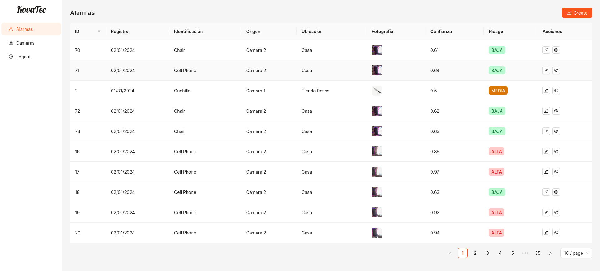
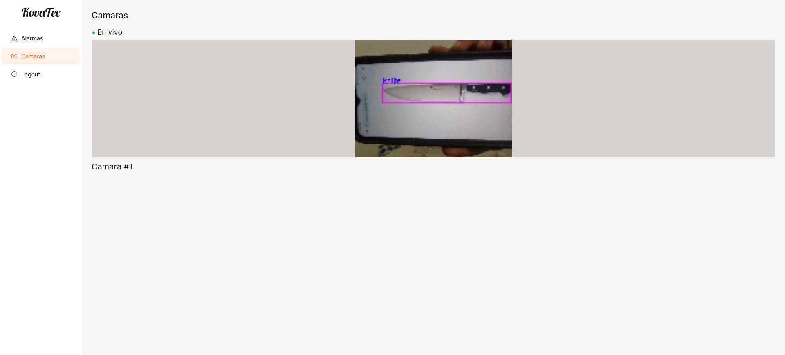

## Sistema de seguridad con alarma - Prototipo
### Descripción
Este proyecto contiene el código para iniciar un modelo reconocedor de objetos en la webcam y envíar las imágenes con la predicción a un servidor websocket ejecutado localmente.
También incluye una aplicación web para la empresa ficticia KovaTec, el cuál muestra los eventos registrados por la alarma y una transmisión en vivo de la cámara.

### Herramientas utilizadas
- Python
- Detector de objetos - YoloV8
- Tornado (Servidor de Websockets)
- Websocket (Cliente de Websockets)
- OpenCV
- React / Refine
- Supabase

### Funcionamiento
- yolo_model/main.py
  - Inicia webcam 
  - Detecta objetos en webcam
  - Registra eventos en base de datos supabase
  - Envía transmisión con WebSockets a ws://localhost:6500/2
- websocket_server/server.py
  - Inicia servidor websocket en puerto 6500
  - Escucha transmisión envíada por la webcam
  - Redirige transmisión de yolo_model/main.py a un cliente conectado a ws://localhost:6500/1
- KovaTec
  - Frontend de Sistema de seguridad
  - Muestra eventos peligrosos detectados
  - Escucha datos envíados del servidor ws://localhost:6500/1
  - Muestra transmisión de cámara en tiempo real a través del websocket mencionado

### Como iniciar
1. Iniciar servidor de websocket
   - cd websocket_server
   - python3 server.py
2. Iniciar reconocimiento de objetos
   - cd yolo_model
   - python3 main.py
3. Iniciar frontend
   - cd KovaTec
   - npm install
   - npm run dev

### Demostración KovaTec

